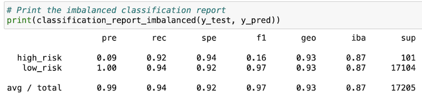

# Credit_Risk_Analysis

## Overview

The purpose of this analysis is to use supervised machine learning models for tests to assess credit risk. Models that were used include RandomOverSampler, SMOTE, ClusterCentroids, SMOTEENN, BalancedRandomForestClassifier, and EasyEnsembleClassifier.

## Results

### Naïve Random Oversampling
-	Balanced accuracy score is 0.6497536370265621
-	Precision is low for High-risk loans
-	Precision is high for Low-risk loans
-	Recall is .62 for high-risk loans and .68 for low-risk loans

### SMOTE Oversampling
-	Balanced accuracy score is 0.6443721269403855
-	Precision is low for High-risk loans
-	Precision is high for Low-risk loans
-	Recall is .63 for high-risk loans and .66 for low-risk loans

### Undersampling
-	Balanced accuracy score is 0.6443721269403855
-	Precision is low for High-risk loans
-	Precision is high for Low-risk loans
-	Recall is .60 for high-risk loans and .43 for low-risk loans

### Combination Sampling
-	Balanced accuracy score is 0.5158151733807124
-	Precision is low for High-risk loans
-	Precision is high for Low-risk loans
-	Recall is .70 for high-risk loans and .57 for low-risk loans

### Balanced Random Forest Classifier
-	Balanced accuracy score is 0.7885466545953005
-	Precision is low for High-risk loans
-	Precision is high for Low-risk loans
-	Recall is .70 for high-risk loans and .87 for low-risk loans

### Easy Ensemble Classifier
-	Balanced accuracy score is 0.9316600714093861
-	Precision is low for High-risk loans
-	Precision is high for Low-risk loans
-	Recall is .92 for high-risk loans and .94 for low-risk loans

## Summary

Of the models tested, the Easy Ensemble Classifier was the most accurate with a score of .93 and was the only model above .80. This model also had the highest recall scores for both high-risk loans and low-risk loans. This model would be the best model to use for further credit risk analysis.

